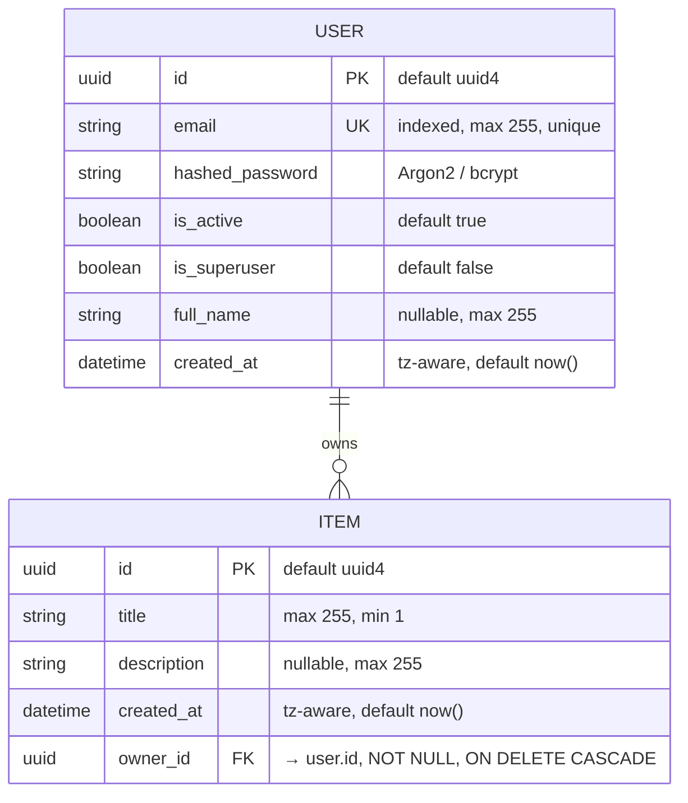
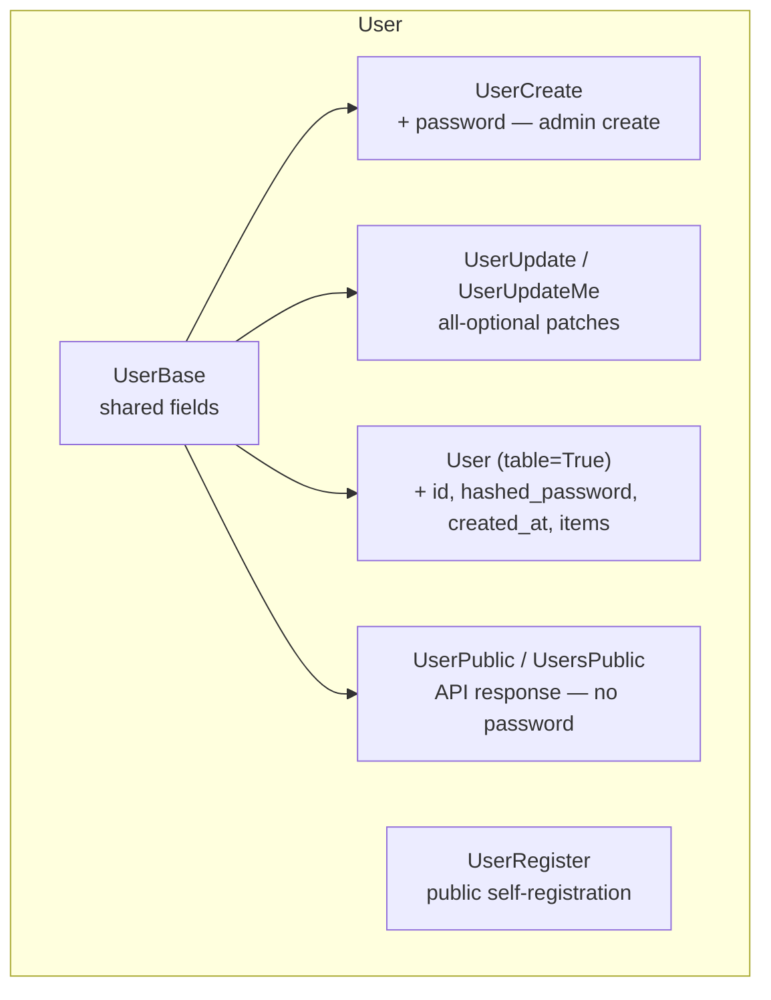
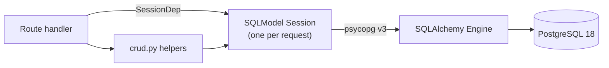
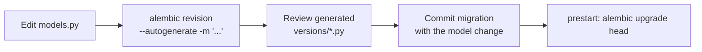

# Data Architecture

> Data model, persistence strategy, schema evolution, and data flow for the
> Full Stack FastAPI Project.

## 1. Overview

A single **PostgreSQL 18** database holds all application state. There is no
secondary store, cache, queue, or analytics pipeline. The schema is small and
relational: two tables — `user` and `item` — in a one-to-many relationship.

All models are defined with **SQLModel** in `backend/app/models.py`. SQLModel
unifies the SQLAlchemy table definition and the Pydantic API schema, so the same
file declares both the persisted tables and the request/response shapes derived
from them.

## 2. Entity-Relationship Model

### `user`

| Column | Type | Constraints | Notes |
|--------|------|-------------|-------|
| `id` | UUID | PK, `default_factory=uuid4` | Application-generated. |
| `email` | VARCHAR(255) | UNIQUE, INDEXED, NOT NULL | Login identity; validated as `EmailStr`. |
| `hashed_password` | VARCHAR | NOT NULL | Argon2 hash (bcrypt verified for legacy). Never returned by the API. |
| `is_active` | BOOLEAN | NOT NULL, default `true` | Inactive users cannot authenticate. |
| `is_superuser` | BOOLEAN | NOT NULL, default `false` | Grants admin endpoints. |
| `full_name` | VARCHAR(255) | NULLABLE | Display name. |
| `created_at` | TIMESTAMPTZ | default `now()` (UTC) | Timezone-aware. |

### `item`

| Column | Type | Constraints | Notes |
|--------|------|-------------|-------|
| `id` | UUID | PK, `default_factory=uuid4` | Application-generated. |
| `title` | VARCHAR(255) | NOT NULL, length 1–255 | |
| `description` | VARCHAR(255) | NULLABLE | |
| `created_at` | TIMESTAMPTZ | default `now()` (UTC) | Timezone-aware. |
| `owner_id` | UUID | FK → `user.id`, NOT NULL, `ON DELETE CASCADE` | Deleting a user deletes their items. |

The cascade is enforced **twice**: at the database level (`ondelete="CASCADE"`
on the FK) and at the ORM level (`cascade_delete=True` on the relationship). DB
enforcement is authoritative; the ORM setting keeps in-session object state
consistent.

## 3. Model Layering

`models.py` declares several classes per entity. This is a deliberate pattern,
not duplication — each class is a distinct contract.

| Suffix / class | Direction | Purpose |
|----------------|-----------|---------|
| `*Base` | — | Fields shared between input and output. |
| `*Create`, `*Register` | Inbound | Request bodies for creation. `UserRegister` is the public-signup subset. |
| `*Update`, `*UpdateMe` | Inbound | All-optional patch bodies. |
| `* (table=True)` | Persisted | The actual database table — adds `id`, server-only fields, relationships. |
| `*Public`, `*sPublic` | Outbound | Response models. **`hashed_password` is structurally excluded** — it is never a field of `UserPublic`. |

The list wrappers `UsersPublic` / `ItemsPublic` carry `{ data: [...], count: int }`
so paginated responses include a total independent of the page size.

## 4. Persistence Strategy

- **Engine** — a single SQLAlchemy `engine` is created in `core/db.py` from the
  computed `SQLALCHEMY_DATABASE_URI` (`postgresql+psycopg://…`).
- **Session scope** — `get_db` yields one `Session` per request via a context
  manager; it is closed when the request ends. Sessions are never shared across
  requests.
- **Access pattern** — routes either use `crud.py` helpers or issue `select()`
  statements directly. There is no repository abstraction; `crud.py` holds the
  reused operations only.
- **Identity** — primary keys are UUIDs generated by the application
  (`uuid4`), not DB sequences. This avoids round-trips for the new id and keeps
  ids non-enumerable.
- **Transactions** — `crud.py` helpers `commit()` then `refresh()` per
  operation; there is no multi-statement transactional unit of work.

## 5. Data Access Rules

Authorization is enforced in the route layer, not the database:

| Resource | Non-superuser | Superuser |
|----------|---------------|-----------|
| `item` list/read | Only rows where `owner_id == current_user.id` | All rows |
| `item` create | `owner_id` forced to `current_user.id` | Same |
| `item` update/delete | Only own rows (404 otherwise) | Any row |
| `user` list / arbitrary read / create / delete | Forbidden (403) | Allowed |
| Own `user` profile | Read/update/delete self | Same |

`read_items` issues a separate `SELECT count(*)` and a paginated `SELECT`, both
narrowed by `owner_id` for non-superusers.

## 6. Schema Evolution — Migrations

Schema changes go through **Alembic** exclusively. `SQLModel.metadata.create_all`
is intentionally left commented out in `core/db.py` — tables are *only* created
by migrations.

**Migration history** (`backend/app/alembic/versions/`):

| Revision | Change |
|----------|--------|
| `e2412789c190` | Initialize models. |
| `d98dd8ec85a3` | Replace integer ids with UUIDs across all models. |
| `9c0a54914c78` | Add `max_length` to string/VARCHAR columns. |
| `1a31ce608336` | Add cascade-delete relationships. |
| `fe56fa70289e` | Add `created_at` to `user` and `item`. |

**Rules**

- Never alter a table without a migration — see [ADR-0005](adr/0005-alembic-migrations.md).
- Generate migrations *inside the running container* so autogenerated files
  land in the mounted `app/` directory.
- Always review the generated script — autogenerate misses some changes (e.g.
  column renames, server defaults) and can produce destructive operations.
- `prestart` runs `alembic upgrade head` on every startup; migrations must be
  idempotent in effect and safe to run against the live schema.

## 7. Data Lifecycle

| Stage | Behaviour |
|-------|-----------|
| **Create** | UUID assigned client-side (app code); `created_at` set to UTC now via `default_factory`. |
| **Seed** | `initial_data.py` creates the `FIRST_SUPERUSER` on first startup if absent (idempotent). |
| **Update** | Patch models exclude unset fields (`model_dump(exclude_unset=True)`); password updates re-hash via `crud.update_user`. |
| **Delete** | Deleting a `user` cascades to their `item` rows (DB-enforced FK). No soft-delete — deletes are permanent. |
| **Retention** | No archival, TTL, or purge policy. Data lives until explicitly deleted. |
| **Backup** | Not provided by the template — the `app-db-data` volume must be backed up by the operator. |

## 8. Storage & Environments

- **Production** — the `db` service uses the named volume `app-db-data`
  (`/var/lib/postgresql/data/pgdata`). Volume lifetime is independent of the
  container.
- **Local** — `compose.override.yml` additionally publishes Postgres on
  `:5432` and Adminer on `:8080` for direct inspection.
- **Credentials** — `POSTGRES_*` come from the root `.env`. The default
  `changethis` password is rejected outside `local` by `Settings` validation.

## 9. Gaps & Considerations

| Gap | Consideration |
|-----|---------------|
| No caching layer | Every read hits PostgreSQL. Acceptable at template scale; add Redis/CDN if read volume grows. |
| `COUNT` per list call | List endpoints run a second query; fine for small tables, watch on large ones. |
| No connection pool tuning | Default SQLAlchemy pool; size against worker count under load. |
| No soft delete / audit trail | Deletes are irreversible; no change history. Add if compliance requires it. |
| Single database | No read replicas, no sharding. Vertical scaling only. |
| Backups are operator-owned | The template ships no backup automation. |
