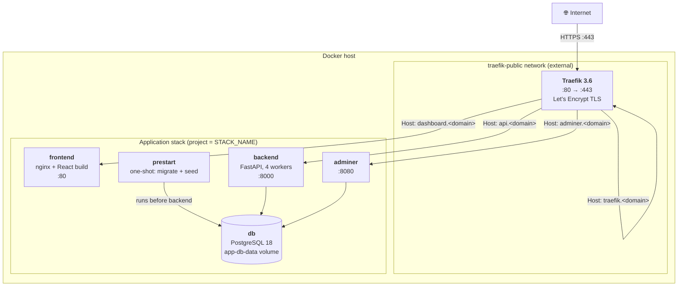
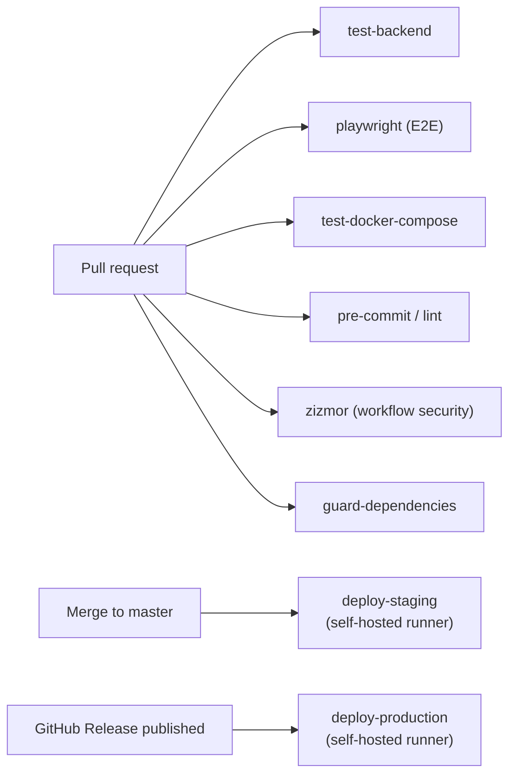

# Deployment Architecture

> Container topology, environments, CI/CD pipelines, and operational concerns
> for the Full Stack FastAPI Project.

## 1. Overview

The system deploys as a set of Docker containers orchestrated by **Docker
Compose** behind a **Traefik** reverse proxy. There is no Kubernetes, no managed
PaaS, and no serverless component — a single Docker host runs the whole stack.

Configuration is layered across three compose files:

| File | Role |
|------|------|
| `compose.yml` | Base definition — all application services. Used as-is for staging/production. |
| `compose.override.yml` | Local-development overlay — published ports, hot-reload, dev-only services. Applied automatically by `docker compose` locally. |
| `compose.traefik.yml` | The shared, public-facing Traefik instance — deployed **once per host**, separately from any stack. |

## 2. Production Topology



### Service inventory

| Service | Image | Restart | Routed host | Internal port |
|---------|-------|---------|-------------|---------------|
| `db` | `postgres:18` | `always` | — (not exposed) | 5432 |
| `prestart` | `${DOCKER_IMAGE_BACKEND}` | one-shot | — | — |
| `backend` | `${DOCKER_IMAGE_BACKEND}` | `always` | `api.<domain>` | 8000 |
| `frontend` | `${DOCKER_IMAGE_FRONTEND}` | `always` | `dashboard.<domain>` | 80 |
| `adminer` | `adminer` | `always` | `adminer.<domain>` | 8080 |
| `traefik` | `traefik:3.6` | `always` | `traefik.<domain>` | 8080 (dashboard) |

### Startup ordering

`depends_on` conditions sequence the stack so the backend never starts against
an un-migrated database:

```mermaid
graph LR
    db["db starts"] -->|"healthcheck: pg_isready"| dbok["db healthy"]
    dbok -->|"condition: service_healthy"| prestart["prestart runs"]
    prestart -->|"alembic upgrade head<br/>+ seed superuser"| done["prestart exits 0"]
    done -->|"condition:<br/>service_completed_successfully"| backend["backend starts"]
    backend -->|"healthcheck:<br/>/api/v1/utils/health-check/"| ready["backend healthy"]
```



## 3. Container Build

Both images are multi-stage and built from the **repository root** context.

### Backend (`backend/Dockerfile`)

- Base `python:3.10`; `uv` copied from the official `astral-sh/uv` image.
- Dependencies installed in a cached layer from `uv.lock` (`--frozen`) before
  app code is copied — keeps rebuilds fast.
- `UV_COMPILE_BYTECODE=1` for faster cold starts.
- Runtime command: `fastapi run --workers 4 app/main.py`. Locally,
  `compose.override.yml` swaps this for `fastapi run --reload` with a
  `develop.watch` sync.

### Frontend (`frontend/Dockerfile`)

- **Stage 0** — `oven/bun:1`: `bun install`, then `bun run build`. The API base
  URL is baked in at build time via the `VITE_API_URL` build arg — it is *not*
  a runtime variable.
- **Stage 1** — `nginx:1`: serves the compiled `dist/` with an SPA-fallback
  config (`nginx.conf` + `nginx-backend-not-found.conf`).

> Because `VITE_API_URL` is compile-time, the frontend image is
> **environment-specific**: production builds with `https://api.<domain>`,
> local with `http://localhost:8000`.

## 4. Environments

| Environment | `ENVIRONMENT` | Compose files | Notes |
|-------------|---------------|---------------|-------|
| **Local** | `local` | `compose.yml` + `compose.override.yml` | Ports published; hot-reload; `mailcatcher`, `playwright`, insecure Traefik dashboard; `private` routes enabled. |
| **Staging** | `staging` | `compose.yml` | Deployed by `deploy-staging.yml`. Default secrets rejected. |
| **Production** | `production` | `compose.yml` | Deployed by `deploy-production.yml` on release. Default secrets rejected; Sentry active. |

Local development additionally runs the **Vite dev server outside Docker**
(`bun run dev`, `:5173`) for the fastest frontend loop — the `frontend` nginx
container is mainly for parity checks.

### Configuration

A single root `.env` supplies every environment variable to both Compose and
the application. Key variables: `DOMAIN`, `STACK_NAME`, `ENVIRONMENT`,
`FRONTEND_HOST`, `BACKEND_CORS_ORIGINS`, `SECRET_KEY`, `POSTGRES_*`,
`FIRST_SUPERUSER*`, `SMTP_*`, `SENTRY_DSN`, `DOCKER_IMAGE_*`, `TAG`. In
staging/production these are sourced from GitHub Actions secrets at deploy time.

## 5. Network & Routing

- **`traefik-public`** — an external Docker network shared between the Traefik
  instance and every routed stack. Created once per host.
- **`default`** — the per-stack network; the database is reachable only here.
- Traefik discovers routes from **Docker labels** on each service and only
  exposes services explicitly labelled (`exposedbydefault=false`).
- Routing is **host-based**; every public hostname is a subdomain of `DOMAIN`.
- HTTP→HTTPS redirect and TLS (Let's Encrypt, ACME TLS challenge) are handled
  entirely by Traefik. See [ADR-0004](adr/0004-traefik-reverse-proxy.md).

## 6. CI/CD Pipelines

GitHub Actions workflows (`.github/workflows/`):



| Workflow | Trigger | Purpose |
|----------|---------|---------|
| `test-backend.yml` | PR / push | Pytest backend suite. |
| `playwright.yml` | PR / push | End-to-end tests against the composed stack. |
| `test-docker-compose.yml` | PR / push | Verifies the stack builds and boots. |
| `pre-commit.yml` | PR / push | Lint/format hooks. |
| `zizmor.yml` | PR / push | Static analysis of the workflows themselves. |
| `guard-dependencies.yml` | PR | Dependency-change guardrails. |
| `deploy-staging.yml` | Push to default branch | Build + `docker compose up -d` on the staging runner. |
| `deploy-production.yml` | Release `published` | Build + `docker compose up -d` on the production runner. |
| `smokeshow.yml`, `labeler.yml`, `latest-changes.yml`, `issue-manager.yml`, `add-to-project.yml`, `detect-conflicts.yml` | various | Coverage publishing & repo automation. |

**Deploy mechanics** — both deploy jobs run on **self-hosted runners** labelled
for their environment, inject secrets as env vars, then:

```
docker compose -f compose.yml --project-name $STACK_NAME build
docker compose -f compose.yml --project-name $STACK_NAME up -d
```

Deploy is in-place: the runner *is* the target host. There is no separate
artifact registry step in the default template — images are built on the host.

## 7. Operational Concerns

| Concern | Current state |
|---------|---------------|
| **Health** | Backend `GET /api/v1/utils/health-check/`; DB `pg_isready`. Compose restarts unhealthy containers (`restart: always`). |
| **Migrations** | Run automatically by `prestart` on every deploy (`alembic upgrade head`). |
| **Zero-downtime** | Not provided — `up -d` recreates changed containers; expect a brief gap. |
| **Rollback** | Re-deploy a previous image `TAG` / previous release. No automated rollback. |
| **Logs** | stdout from each container; collected by the Docker runtime / host. No aggregation shipped. |
| **Monitoring** | Sentry for errors & traces (non-local). No metrics/APM dashboard. |
| **Backups** | The `app-db-data` volume must be backed up by the operator — not automated. |
| **Scaling** | Backend is stateless and can be scaled (Compose replicas / multiple hosts); DB and Traefik are single instances. |
| **TLS renewal** | Automatic via Traefik + Let's Encrypt; certs persisted to the `traefik-public-certificates` volume. |

## 8. Deployment Risks

| Risk | Mitigation / recommendation |
|------|-----------------------------|
| Single Docker host | SPOF for the whole stack. Move to multi-host / orchestrator for HA. |
| Build-on-host deploys | Couples build to the runner; consider a registry + pull-based deploy. |
| No zero-downtime strategy | Add rolling updates or a blue/green setup if downtime is unacceptable. |
| `VITE_API_URL` baked at build | Frontend image is environment-locked; promoting an image across environments requires a rebuild. |
| Adminer exposed in production | Remove or access-restrict for production deployments. |
| Manual DB backups | Automate `pg_dump` + off-host retention. |
| Migrations auto-run on deploy | A bad migration blocks `prestart` and the backend; review migrations carefully and keep them reversible. |
