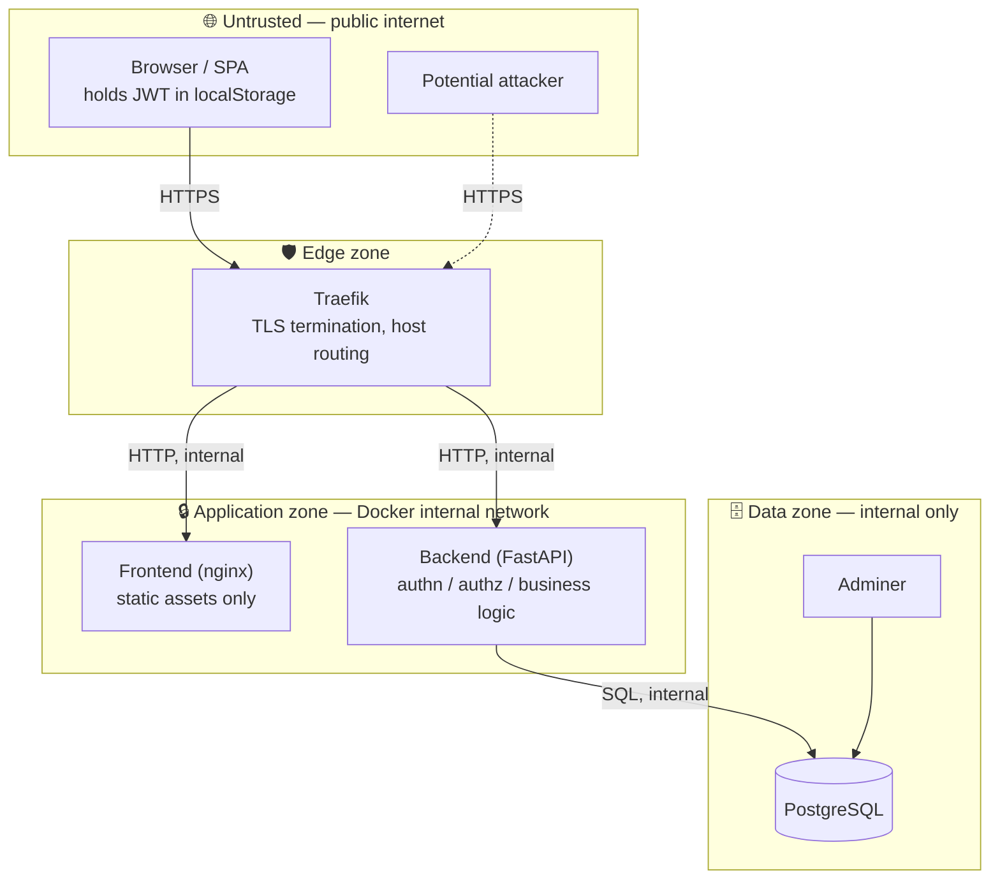
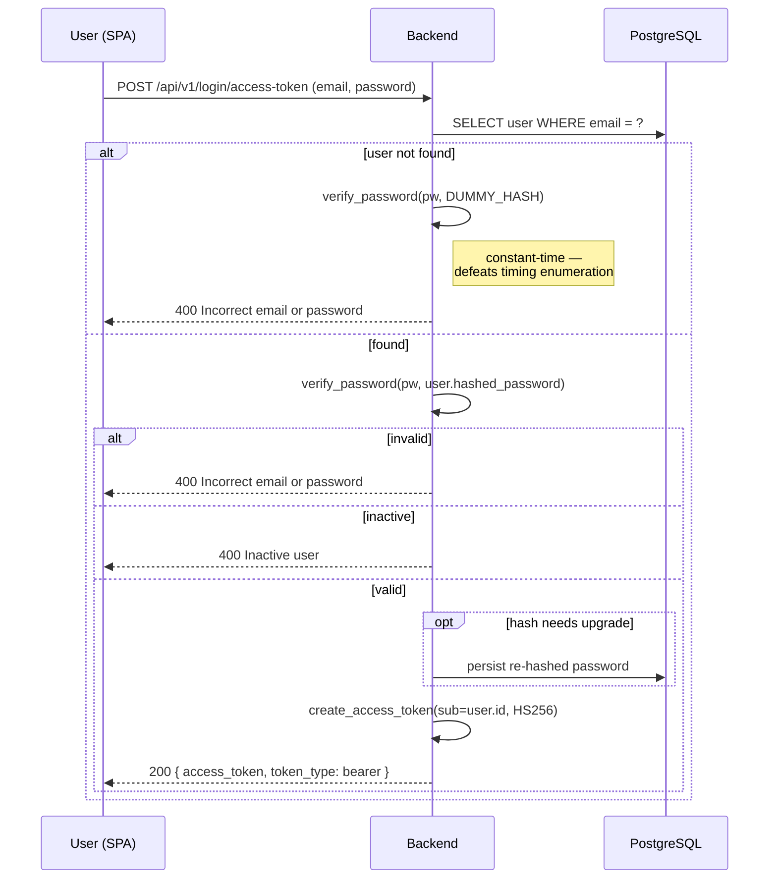
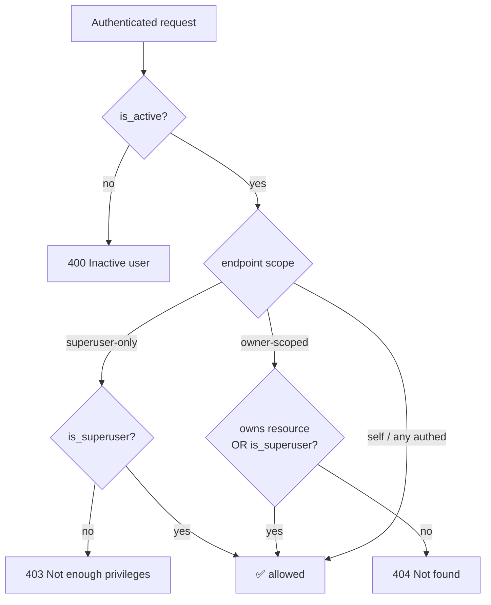
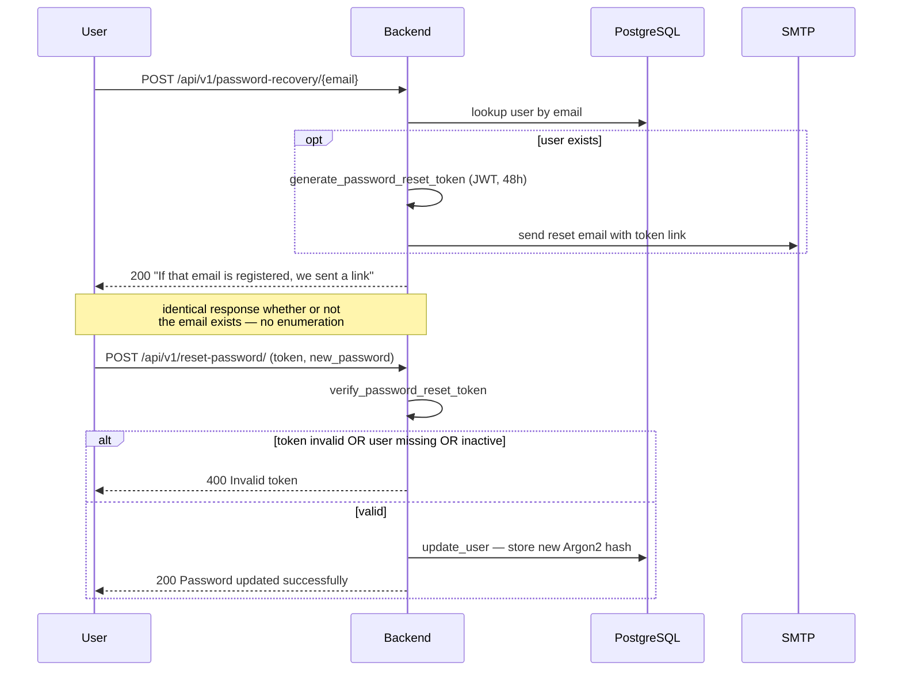

# Security Architecture

> Authentication and authorization flows, trust zones, threat model, and
> secrets handling for the Full Stack FastAPI Project.

## 1. Overview

The application uses **stateless JWT bearer authentication**. There are no
server-side sessions: a successful login returns a signed token that the SPA
stores and replays on every request. Authorization is **role-based** with two
levels — regular user and superuser — plus **ownership scoping** on the `Item`
resource.

## 2. Trust Zones

| Zone | Trust | Boundary control |
|------|-------|------------------|
| Public internet | None | All traffic assumed hostile. |
| Edge (Traefik) | Low | TLS termination, HTTP→HTTPS redirect, host-based routing. Only explicitly labelled services are exposed (`exposedbydefault=false`). |
| Application zone | Medium | Reached only via Traefik. Backend enforces authn/authz on every protected route. |
| Data zone | High | PostgreSQL is **not** routed by Traefik — no public hostname. Reachable only on the internal Docker network (and `:5432` locally for dev). |

**Boundary crossings to note**

- The SPA (untrusted) calls the backend directly through the generated client
  — the frontend nginx container is *not* an API gateway. The backend is the
  sole enforcement point.
- Adminer is Traefik-routed (`adminer.<domain>`) and reaches the database. In
  production it should be firewalled, removed, or access-controlled.

## 3. Authentication

### 3.1 Token issuance — login

- **Endpoint** — `POST /api/v1/login/access-token`, OAuth2
  password-grant compatible (`OAuth2PasswordRequestForm`).
- **Token** — JWT, **HS256**, signed with `SECRET_KEY`. Claims: `sub` (user
  UUID as string) and `exp`. Lifetime: `ACCESS_TOKEN_EXPIRE_MINUTES` = **8
  days**.
- **Storage** — the SPA writes the token to `localStorage`; `main.tsx` wires
  it into the generated client as a bearer header for every call.

### 3.2 Token verification — protected requests

`get_current_user` (`api/deps.py`) runs as a FastAPI dependency:

1. Decode the JWT with `SECRET_KEY` / HS256. Invalid or expired → **403**.
2. Load the `User` by `sub`. Missing → **404**.
3. Reject if `is_active` is false → **400**.
4. `get_current_active_superuser` additionally requires `is_superuser` → **403**
   otherwise.

The SPA treats **401/403** as session loss: `main.tsx` clears the token and
redirects to `/login` via the TanStack Query error caches.

### 3.3 Password storage

- Hashing via **`pwdlib`** with `Argon2Hasher` (primary) and `BcryptHasher`
  (verification fallback for legacy hashes).
- `verify_and_update` transparently re-hashes a password with the current
  algorithm/parameters on successful login when the stored hash is outdated.
- Plaintext passwords are never logged, stored, or returned. `hashed_password`
  is not a field of any `*Public` response model.
- Policy: 8–128 characters (enforced by Pydantic `Field` on the input models).

## 4. Authorization Model

| Level | Granted by | Examples |
|-------|-----------|----------|
| Authenticated | Valid token + active user | Read/update own profile, own items, `login/test-token`. |
| Owner-scoped | `owner_id == user.id` (or superuser) | Item read/update/delete — non-owners get **404**, not 403, to avoid leaking existence. |
| Superuser | `is_superuser == true` | List/manage all users, manage any item, `utils/test-email`, password-recovery HTML preview. |

Authorization lives entirely in the **route layer** (via `deps.py` guards and
explicit owner checks). The database does not enforce row-level security.

## 5. Password Recovery

Anti-enumeration is deliberate: `password-recovery` always returns the same
message, and `reset-password` returns the same `400 Invalid token` for an
unknown user as for a bad token. The reset token is a separate JWT with a
48-hour expiry (`EMAIL_RESET_TOKEN_EXPIRE_HOURS`).

## 6. Secrets & Configuration

| Secret | Source | Protection |
|--------|--------|------------|
| `SECRET_KEY` | `.env` / CI secret | Signs all JWTs. Rotating it invalidates every active token. |
| `POSTGRES_PASSWORD` | `.env` / CI secret | DB credential. |
| `FIRST_SUPERUSER_PASSWORD` | `.env` / CI secret | Seeds the initial admin. |
| `SMTP_PASSWORD` | `.env` / CI secret | Email account credential. |
| `SENTRY_DSN` | `.env` / CI secret | Telemetry endpoint. |

- **Default-secret guard** — `Settings._enforce_non_default_secrets` checks
  `SECRET_KEY`, `POSTGRES_PASSWORD`, `FIRST_SUPERUSER_PASSWORD`. A value of
  `changethis` only **warns** in `local` but **raises** in staging/production,
  failing startup.
- **CI/CD** — production/staging values come from GitHub Actions repository
  secrets, injected as environment variables at deploy time
  (`deploy-*.yml`); they are not committed.
- **Single `.env`** — one root file feeds both services and Compose. It is
  gitignored; only `.env` placeholders ship in the template.

## 7. Network & Transport Security

- **TLS** — terminated at Traefik using Let's Encrypt certificates obtained via
  the ACME TLS challenge; HTTP is permanently redirected to HTTPS.
- **CORS** — `CORSMiddleware` allows only `FRONTEND_HOST` plus
  `BACKEND_CORS_ORIGINS`; credentials allowed, all methods/headers permitted
  for those origins.
- **Service exposure** — Traefik’s `exposedbydefault=false` means a container
  is only routable if it carries explicit `traefik.enable=true` labels. The
  database carries none.
- **Internal traffic** — service-to-service traffic inside the Docker network
  is plain HTTP/SQL; it relies on network isolation, not in-cluster TLS.

## 8. Threat Model (STRIDE summary)

| Threat | Vector | Mitigation | Residual risk |
|--------|--------|-----------|---------------|
| **Spoofing** | Forged token | HS256 signature over `SECRET_KEY`; `sub` resolved to a live, active user. | Leaked `SECRET_KEY` forges any identity. |
| **Tampering** | Modified token / payload | JWT signature; Pydantic validation of all request bodies. | — |
| **Repudiation** | Deny an action | Sentry captures errors; access logs at Traefik/Uvicorn. | No per-user audit log of mutations. |
| **Information disclosure** | Email enumeration | Uniform responses on login & recovery; `DUMMY_HASH` constant-time path. | — |
| **Information disclosure** | Token theft | HTTPS in transit. | `localStorage` is readable by any injected script → **XSS = token theft**. |
| **Denial of service** | Request flooding | — | **No rate limiting** on login or any endpoint. |
| **Elevation of privilege** | Access admin endpoints | `get_current_active_superuser` guard; owner checks return 404. | `private` routes create users unauthenticated if `ENVIRONMENT` is misset. |

## 9. Known Weaknesses & Recommendations

| Weakness | Risk | Recommendation |
|----------|------|----------------|
| Token in `localStorage` | XSS → full account takeover | Consider httpOnly + `SameSite` cookies; enforce a strict Content-Security-Policy. See [ADR-0003](adr/0003-jwt-bearer-auth.md). |
| No token revocation / refresh | Leaked token valid up to 8 days | Add short-lived access + refresh tokens, or a server-side denylist. |
| No rate limiting | Credential stuffing / brute force | Add rate limiting (Traefik middleware or app-level) on `login` and `password-recovery`. |
| Long token lifetime (8 days) | Wide exposure window | Shorten access-token TTL; pair with refresh tokens. |
| `private` route group | Unauthenticated user creation if exposed | Ensure `ENVIRONMENT` is never `local` outside dev; consider removing the group from production images. |
| Adminer publicly routable | DB admin surface | Remove, firewall, or auth-gate Adminer in production. |
| No security headers / CSP | Clickjacking, XSS amplification | Add HSTS, `X-Frame-Options`/`frame-ancestors`, CSP at Traefik or nginx. |
| Plain internal traffic | In-network interception | Acceptable with strong network isolation; consider mTLS for higher-assurance deployments. |

## 10. Security Checklist for Changes

- [ ] New endpoints declare the correct auth dependency (`CurrentUser` /
      `get_current_active_superuser`) — never leave a mutation unprotected.
- [ ] Owner-scoped resources check ownership and return **404** (not 403) to
      non-owners.
- [ ] No secret, password, or token is logged or placed in a response model.
- [ ] New config secrets are added to the `changethis` default-secret guard if
      they must not ship with a placeholder.
- [ ] Error responses for auth failures stay generic — no user-existence leak.
- [ ] After any auth/route change, regenerate the API client so the frontend
      stays in contract.
