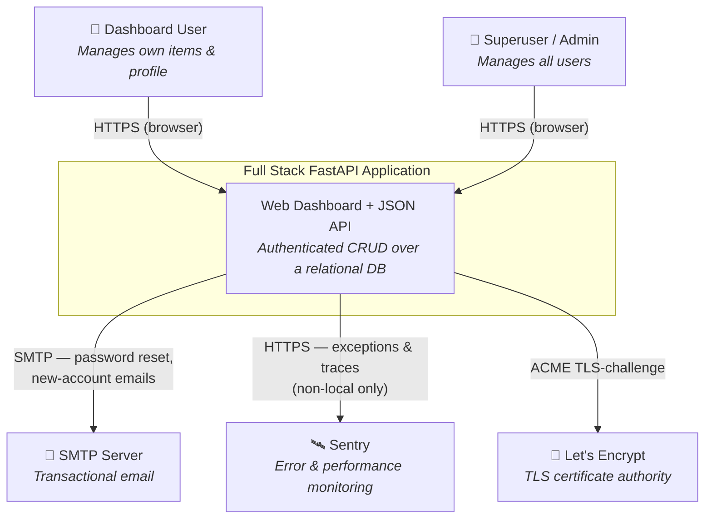
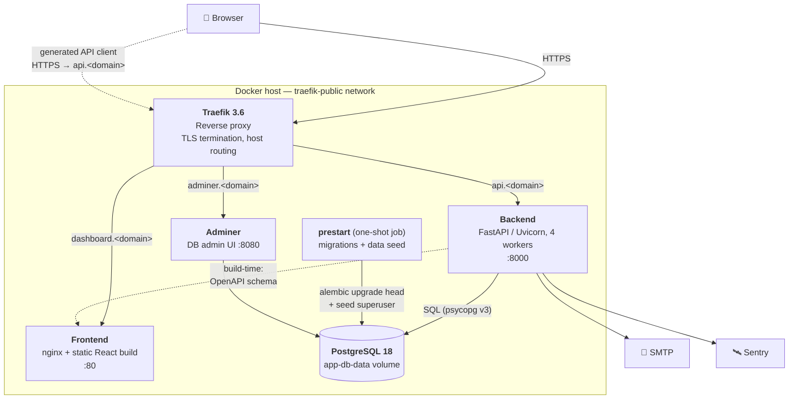
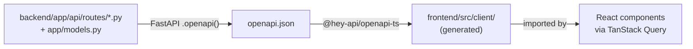
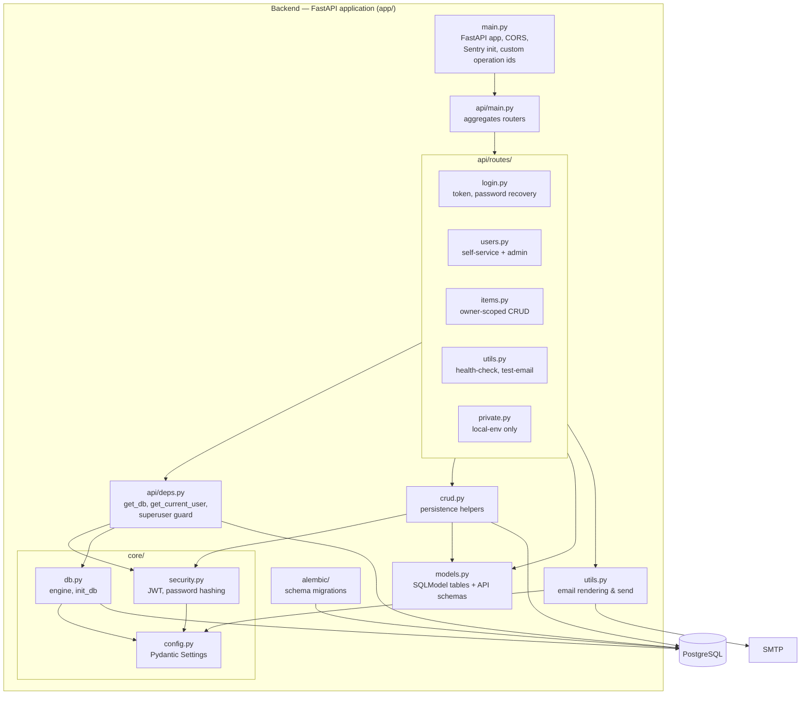
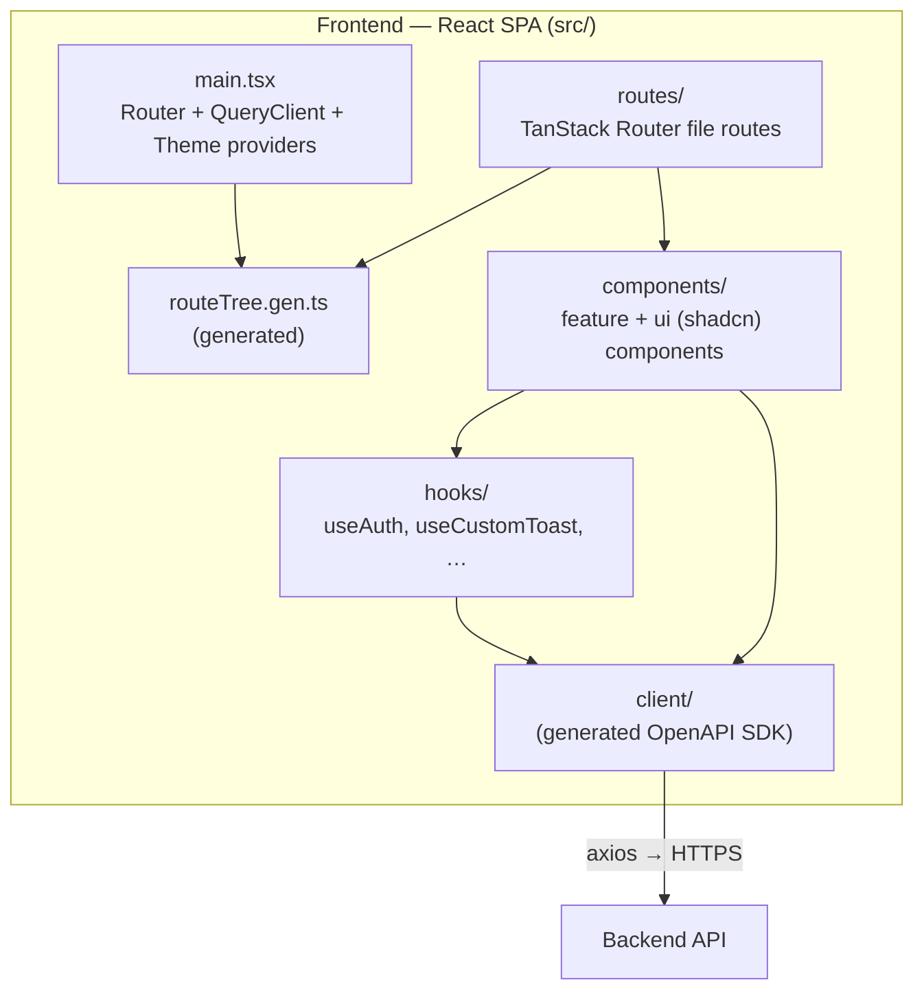
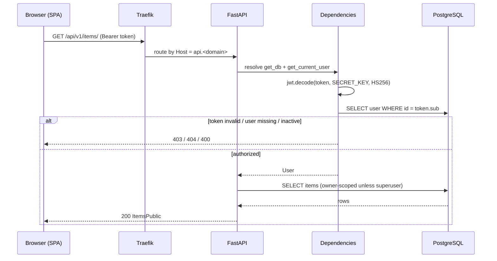
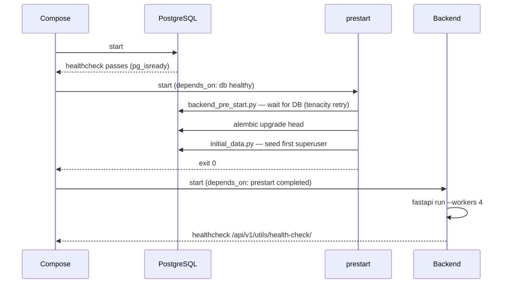

# System Architecture

> C4 context/container/component views, runtime scenarios, and quality
> attributes for the Full Stack FastAPI Project.

## 1. Introduction & Goals

A full-stack web application template: an authenticated dashboard backed by a
JSON API over a relational database. It ships two deployable applications and
the infrastructure to run them.

**Primary functional goals**

- Email + password authentication with JWT-based sessions.
- User management (self-service profile + superuser admin of all users).
- A generic CRUD resource (`Item`) demonstrating per-owner data isolation.
- Email-based password recovery.

**Architectural goals**

- **Contract-first frontend/backend integration** — the API is a typed contract,
  not an informal agreement.
- **Type safety end to end** — `mypy --strict` on the backend, TypeScript on the
  frontend, both fed by the same schema.
- **Reproducible deployment** — one `docker compose` command brings up the whole
  stack identically across environments.
- **Template reusability** — the repo is also a Copier template; structure
  favours clarity and convention over cleverness.

## 2. Constraints

| Constraint | Detail |
|------------|--------|
| Backend runtime | Python `>=3.10,<4.0`; Docker image on `python:3.10`. |
| Frontend runtime | Node toolchain via **Bun**; built to static assets served by nginx. |
| Database | PostgreSQL (image `postgres:18`); accessed with the `psycopg` v3 driver. |
| Packaging | Backend deps via `uv` (locked `uv.lock`); frontend via Bun (`bun.lock`). |
| Reverse proxy | Traefik 3.6, host-based routing, Let's Encrypt TLS. |
| API contract | OpenAPI 3 schema generated by FastAPI; consumed by `@hey-api/openapi-ts`. |
| Shared config | A single root `.env` is read by both services and Docker Compose. |

## 3. C4 Level 1 — System Context

**Actors**

- **Dashboard User** — an authenticated, non-privileged account. Sees and
  mutates only their own `Item` records and their own profile.
- **Superuser / Admin** — an elevated account (`is_superuser = true`). Can list
  and manage all users and all items. The first superuser is seeded at startup
  from `FIRST_SUPERUSER` / `FIRST_SUPERUSER_PASSWORD`.

**External systems**

- **SMTP Server** — sends password-recovery and new-account emails. Optional:
  if `SMTP_HOST` / `EMAILS_FROM_EMAIL` are unset, email features are silently
  disabled (`settings.emails_enabled`). Locally, a `mailcatcher` container
  stands in.
- **Sentry** — receives exceptions and traces when `SENTRY_DSN` is set and
  `ENVIRONMENT != "local"`.
- **Let's Encrypt** — issues TLS certificates to Traefik via the ACME TLS
  challenge in staging/production.

## 4. C4 Level 2 — Container View

| Container | Technology | Responsibility |
|-----------|-----------|----------------|
| **Traefik** | Traefik 3.6 | Single ingress. Host-based routing, HTTP→HTTPS redirect, Let's Encrypt TLS. Reads routing from Docker labels. |
| **Frontend** | React 19, Vite 7, nginx | Serves the compiled SPA. SPA-fallback routing. No server-side logic. |
| **Backend** | FastAPI, Uvicorn (4 workers), SQLModel | The entire API surface, authn/authz, business logic, persistence, email dispatch. |
| **prestart** | Same image as backend | One-shot startup job: waits for the DB, runs `alembic upgrade head`, seeds the first superuser. Backend waits for it to complete successfully. |
| **Database** | PostgreSQL 18 | Single relational store. Persisted to the `app-db-data` named volume. |
| **Adminer** | Adminer | Browser-based DB administration. Convenience tool, not part of the application. |

**Local-only containers** (`compose.override.yml`): a `proxy` Traefik with the
insecure dashboard enabled, `mailcatcher` (SMTP sink + web UI on `:1080`), and
`playwright` for end-to-end tests. The frontend dev server (Vite, `:5173`) runs
**outside** Docker during development; only the production image uses nginx.

### The frontend ↔ backend contract

The frontend never hand-writes HTTP calls. The backend's OpenAPI schema is
dumped to `openapi.json` and `@hey-api/openapi-ts` generates a typed client into
`frontend/src/client/` (`sdk.gen.ts`, `types.gen.ts`, `schemas.gen.ts`).

Any backend change to routes, request/response models, or status codes
**requires** regenerating the client (`bash scripts/generate-client.sh`). Method
names are stable because `custom_generate_unique_id` derives each operation id
as `{tag}-{route name}`. See [ADR-0002](adr/0002-generated-typed-api-client.md).

## 5. C4 Level 3 — Backend Component View

| Component | File(s) | Responsibility |
|-----------|---------|----------------|
| App entry | `app/main.py` | Builds the `FastAPI` app, mounts the aggregate router under `/api/v1`, configures CORS, initialises Sentry, sets the operation-id function. |
| Router aggregation | `app/api/main.py` | Includes the `login`, `users`, `utils`, `items` routers; includes `private` only when `ENVIRONMENT == "local"`. |
| Endpoints | `app/api/routes/*.py` | One module per resource group. HTTP concerns only — validation, status codes, response models. |
| Dependencies | `app/api/deps.py` | `get_db` (request-scoped `Session`), `get_current_user` (JWT decode → `User`), `get_current_active_superuser` (privilege guard). Exposed as `SessionDep`, `CurrentUser` annotations. |
| CRUD helpers | `app/crud.py` | Reusable persistence operations (`create_user`, `update_user`, `authenticate`, `create_item`, …). Sits between routes and the ORM. |
| Domain models | `app/models.py` | **All** SQLModel table models and Pydantic API schemas in one file (see [ADR-0001](adr/0001-sqlmodel-single-models-file.md)). |
| Configuration | `app/core/config.py` | `Settings` (Pydantic Settings) — typed env config, computed DSN/CORS, secret validation. |
| DB engine | `app/core/db.py` | SQLAlchemy `engine`; `init_db` seeds the first superuser. |
| Security | `app/core/security.py` | JWT encode (HS256), password hash/verify (`pwdlib`, Argon2 + bcrypt). |
| Email | `app/utils.py` | MJML→HTML template rendering and SMTP send. |
| Migrations | `app/alembic/` | Versioned schema changes; `alembic upgrade head` at startup. |

### Frontend component view

- **Routing** — TanStack Router, file-based. `routes/_layout.tsx` is an
  authenticated shell (`beforeLoad` redirects to `/login` when no token);
  `routes/login.tsx`, `signup.tsx`, `recover-password.tsx`,
  `reset-password.tsx` are public. `routeTree.gen.ts` is generated.
- **Data fetching** — TanStack Query wraps the generated client services. No
  raw `fetch`/`axios` in feature code.
- **State** — server state lives in TanStack Query; the only client-persisted
  state is the `access_token` in `localStorage` and the UI theme.
- **UI** — shadcn/ui primitives (Radix-based) in `components/ui/`; forms use
  `react-hook-form` + `zod`.

## 6. Runtime View

### 6.1 Authenticated API request

### 6.2 Startup sequence

Login and password-recovery runtime flows are detailed in
[`security-architecture.md`](security-architecture.md).

## 7. Deployment View

Summarised here; see [`deployment-architecture.md`](deployment-architecture.md)
for the full topology, environments, and CI/CD.

- Three compose files layer up: `compose.yml` (base) +
  `compose.override.yml` (local dev) or `compose.traefik.yml` (shared
  production proxy).
- Traefik routes by hostname: `dashboard.<domain>`, `api.<domain>`,
  `adminer.<domain>`, `traefik.<domain>`.
- `deploy-staging.yml` / `deploy-production.yml` GitHub Actions build and
  `docker compose up -d` on self-hosted runners; production deploys on GitHub
  release publication.

## 8. Cross-Cutting Concepts

| Concern | Approach |
|---------|----------|
| Configuration | Single typed `Settings` object; one root `.env`; never `os.environ` directly. Default-secret values (`changethis`) warn locally, **raise** in staging/production. |
| Persistence | SQLModel over SQLAlchemy; one `Session` per request via `get_db`; schema changes only through Alembic migrations. |
| API typing | Strict `mypy`; Pydantic validation at the edge; OpenAPI schema generated, not written. |
| Error tracking | Sentry SDK, enabled outside `local`. |
| CORS | `CORSMiddleware` allows `FRONTEND_HOST` + `BACKEND_CORS_ORIGINS`. |
| Logging | Uvicorn/Traefik access logs to stdout; collected by the Docker runtime. |
| Health checks | Backend `GET /api/v1/utils/health-check/`; DB `pg_isready`. Compose gates dependent services on these. |
| Email | Optional; MJML sources compiled to HTML templates; feature-flagged by `emails_enabled`. |

## 9. Quality Attributes

| Attribute | How it is addressed | Known limits |
|-----------|--------------------|--------------|
| **Security** | JWT auth, Argon2 hashing, superuser guard, timing-attack & email-enumeration mitigations, enforced non-default secrets. | Token in `localStorage` (XSS-exposed); no refresh tokens / revocation. See security doc. |
| **Scalability** | Backend is stateless → horizontally scalable; 4 Uvicorn workers per container; Traefik load-balances. | Single PostgreSQL instance — vertical scaling only; no read replicas or caching layer. |
| **Reliability** | `restart: always`; health-gated `depends_on`; DB connection retry on startup. | Single DB and single proxy are SPOFs in the default topology. |
| **Maintainability** | Strict typing both sides; generated client removes a class of integration bugs; conventional layered structure. | `models.py` and the generated client are change-amplifiers — one edit ripples. |
| **Performance** | Async-capable FastAPI; static frontend served by nginx; pagination (`skip`/`limit`) on list endpoints. | No query caching; list endpoints issue a separate `COUNT`. |
| **Observability** | Sentry errors + traces; health endpoints; access logs. | No metrics endpoint, no distributed tracing, no structured app logs. |
| **Testability** | Pytest (backend, needs PostgreSQL); Playwright E2E (needs running stack); CI runs both. | E2E requires the full Docker stack. |

## 10. Risks & Technical Debt

| Item | Impact | Notes |
|------|--------|-------|
| Token in `localStorage` | Security | Vulnerable to XSS token theft; httpOnly cookies would be stronger. Tracked in [ADR-0003](adr/0003-jwt-bearer-auth.md). |
| No token revocation | Security | A leaked JWT is valid for its full 8-day lifetime. |
| Single DB / single proxy | Availability | Default topology has no HA; acceptable for a template, must be revisited for production scale. |
| Generated artefacts in VCS | Maintainability | `src/client/` and `routeTree.gen.ts` are committed; drift possible if generation is skipped. CI should verify they are current. |
| `private` route group | Security | Test-only endpoints; gated by `ENVIRONMENT == "local"` — a misconfigured env would expose unauthenticated user creation. |
| `frontend` skill mismatch | DX | `project.yml` points the frontend at the `frontend-nextjs` skill; routing conventions differ (Vite + TanStack Router). A `frontend-react` skill is the intended fix. |

## 11. Glossary

| Term | Meaning |
|------|---------|
| SPA | Single-Page Application — the React frontend. |
| Generated client | The typed TypeScript SDK in `frontend/src/client/`, produced from the OpenAPI schema. |
| Superuser | A `User` with `is_superuser = true`; elevated privileges. |
| prestart | The one-shot container that migrates and seeds the DB before the backend starts. |
| Operation id | The stable `{tag}-{name}` identifier FastAPI assigns each route; drives generated client method names. |
| Copier template | This repo doubles as a project scaffold; `copier.yml` + `hooks/` rewrite files on generation. |
