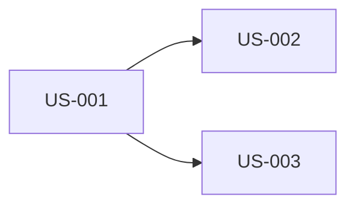

# User Stories: Items Card View

**Source:** ClickUp task [86c9xq200](https://app.clickup.com/t/86c9xq200) — "Vorrei che gli item siano visualizzati anche sotto forma di Card"
**Design doc:** `docs/plans/2026-05-22-items-card-view/design.md`
**Date:** 2026-05-22
**Author:** Claude Story Generator
**Status:** Draft — Pending team review

---

## Overview

The Items page currently lists items only as a table. This feature adds an
alternative **card grid** view and a toggle to switch between the two. The
table stays the default; the user's choice persists across reloads. Frontend
only — no backend or API change.

## Personas

| Persona | Description | Key Needs |
|---------|-------------|-----------|
| Authenticated user | Any logged-in user managing their own items on `/items`. | Browse items in a visual layout; keep their preferred view. |

---

## US-001: View items as a card grid

**As a** authenticated user
**I want to** see my items rendered as cards in a responsive grid
**So that** I can browse them in a more visual, scannable layout

**Acceptance Criteria:**

- **Given** I am on the Items page in card view
  **When** items have loaded
  **Then** each item is shown as a card with its title, description, and short ID

- **Given** an item has no description
  **When** its card renders
  **Then** a muted/italic "No description" placeholder is shown

- **Given** the viewport width changes
  **When** I view the card grid
  **Then** it shows 1 column on mobile, 2 on small screens, 3 on large screens

- **Given** a card is displayed
  **When** I open its actions menu
  **Then** I can Edit or Delete the item, identically to the table row

- **Given** a card is displayed
  **When** I click the copy-ID control
  **Then** the item ID is copied to the clipboard with visual confirmation

- **Given** there are no items
  **When** the card view is active
  **Then** the existing empty state ("You don't have any items yet") is shown

**Notes:**
- Reuse `Card*` primitives, `ItemActionsMenu`, and the `CopyId` helper
  (extract `CopyId` from `columns.tsx` so table and card share it).
- New components: `ItemCard`, `ItemsGrid`. No backend change.

**Priority:** Must
**Size:** M

---

## US-002: Switch between Table and Card view

**As a** authenticated user
**I want to** toggle between the table and card views and have my choice remembered
**So that** I can use my preferred layout without re-selecting it each visit

**Acceptance Criteria:**

- **Given** I open the Items page for the first time
  **When** the page loads
  **Then** the table view is shown by default

- **Given** I am on the Items page
  **When** I click the "Cards" / "Table" toggle
  **Then** the content switches to the corresponding view immediately

- **Given** I selected a view
  **When** I reload the page or navigate back to Items
  **Then** the last selected view is restored

- **Given** `localStorage` is unavailable or throws
  **When** I use the toggle
  **Then** the view still switches for the session without errors (defaults on reload)

**Notes:**
- shadcn `Tabs` as a controlled segmented control bound to
  `useLocalStorage("items-view", "table")`.
- New hook: `useLocalStorage`. Depends on US-001 (a card view to switch to).

**Priority:** Must
**Size:** S

---

## US-003: Card view loading skeleton

**As a** authenticated user
**I want to** see a card-shaped loading placeholder while items load in card view
**So that** the loading state matches the layout I am about to see

**Acceptance Criteria:**

- **Given** the card view is active
  **When** items are still loading
  **Then** a grid of card-shaped skeleton placeholders is shown

- **Given** the table view is active
  **When** items are loading
  **Then** the existing table skeleton (`PendingItems`) is shown

- **Given** items finish loading
  **When** the data resolves
  **Then** the skeleton is replaced by the real content without layout shift

**Notes:**
- New component: `PendingItemsGrid` (reuses `Skeleton`). Depends on US-001.

**Priority:** Should
**Size:** S

---

## Dependency Map

US-001 is the foundation (card rendering). US-002 (toggle) and US-003
(skeleton) both build on it and can be done in parallel afterwards.

## Implementation Order

| Phase | Stories | Rationale |
|-------|---------|-----------|
| 1 - Foundation | US-001 | Card components — nothing to switch to without them. |
| 2 - Integration | US-002, US-003 | Toggle + loading state; parallel once cards exist. |

---

## Summary

| Metric | Count |
|--------|-------|
| Total Stories | 3 |
| Must Have | 2 |
| Should Have | 1 |
| Could Have | 0 |
| Estimated Sprints | 1 |

---

## Assumptions & Open Questions

### Assumptions
- The card view reuses the existing `readItems({skip:0, limit:100})` query;
  no card-specific pagination is needed for v1.
- "Short ID" on a card means the full UUID with a copy control, matching the
  table's ID column behaviour.

### Open Questions
- None.

### Out of Scope
- Backend / API / OpenAPI changes.
- Filtering, sorting, or search across views.
- Client-side pagination for the card grid.

### Technical Spikes
- None.
