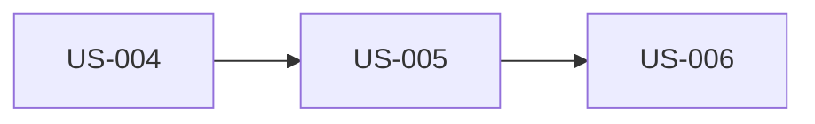

# User Stories: Items Free-Text Search

**Source:** ClickUp task [123y1w8g9t9](https://app.clickup.com/t/123y1w8g9t9) — "Ricerca Items con testo libero"
**Design doc:** `docs/plans/2026-10-01-items-search/design.md`
**Date:** 2026-10-01
**Author:** Claude Story Generator
**Status:** Draft — Pending team review

---

## Overview

Users can type free text on the Items page and see only items whose title or
description contains it. Search runs server-side (`GET /items/?q=`), the query
lives in the URL, and both Table and Cards views show the filtered result.

## Personas

| Persona | Description | Key Needs |
|---------|-------------|-----------|
| User | Regular logged-in user | Find own items quickly by text |
| Superuser | Admin with access to all items | Find any item across users |
| API consumer | Frontend client / integrator | Filter items via a stable, additive API param |

---

## US-004: Search items by text via the API

**As an** API consumer
**I want to** pass a free-text `q` parameter to the items list endpoint
**So that** I get only matching items and a matching total count

**Acceptance Criteria:**

- **Given** items "Blue Mug" and "Red Chair" (description "blue legs")
  **When** I call `GET /items/?q=BLUE`
  **Then** both are returned (case-insensitive match on title or description) and `count` is 2

- **Given** any set of items
  **When** I call `GET /items/` without `q`, or with `q` empty/whitespace
  **Then** the response is identical to today's behavior

- **Given** an item titled "100% cotton" and another titled "1000 cats"
  **When** I call `GET /items/?q=%25` (`q=%`)
  **Then** only "100% cotton" is returned — `%` and `_` match literally

- **Given** a regular user and items owned by another user that match `q`
  **When** the regular user searches
  **Then** only their own items are returned; a superuser gets matches from all owners

- **Given** `q` longer than 255 characters
  **When** I call the endpoint
  **Then** I get a 422 validation error

**Notes:**
- Additive, non-breaking contract change; regenerate `frontend/src/client/` afterwards.
- No index/migration; `ILIKE` seq scan acceptable at template scale.

**Priority:** Must
**Size:** S

---

## US-005: Search items from the Items page

**As a** user
**I want to** type in a search field on the Items page
**So that** the list narrows to the items I'm looking for

**Acceptance Criteria:**

- **Given** I am on `/items`
  **When** I type "mug" in the "Search items…" field
  **Then** after a short pause (~300 ms) the URL becomes `/items?q=mug` and only matching items are shown

- **Given** I am on `/items?q=mug`
  **When** I reload the page or come back via browser back
  **Then** the field shows "mug" and the filtered results are shown

- **Given** a search is active
  **When** I switch between Table and Cards
  **Then** both views show the same filtered items and `q` stays in the URL

- **Given** results are already shown
  **When** I keep typing
  **Then** the previous results stay visible until the new ones arrive (no skeleton flash) and history isn't flooded with one entry per keystroke

- **Given** text in the field
  **When** I click the clear (×) button or press Esc
  **Then** the field empties, `q` is removed from the URL, and all items are shown

**Notes:**
- Field has an accessible name ("Search items"); clear button labelled "Clear search".
- Invalid `q` in the URL falls back to no search instead of erroring.

**Priority:** Must
**Size:** M

---

## US-006: No-results state for a search

**As a** user
**I want to** see a clear message when my search matches nothing
**So that** I understand the list is empty because of the search, not because I have no items

**Acceptance Criteria:**

- **Given** I have items
  **When** I search for text that matches none of them
  **Then** I see `No items match "{q}"` with a "Clear search" button, instead of "You don't have any items yet"

- **Given** the no-results state is shown
  **When** I click "Clear search"
  **Then** the search is cleared and all my items are shown

- **Given** I have no items and no search is active
  **When** I open `/items`
  **Then** the existing "You don't have any items yet" state is shown unchanged

**Priority:** Should
**Size:** S

---

## Dependency Map

## Implementation Order

| Phase | Stories | Rationale |
|-------|---------|-----------|
| 1 - API | US-004 | Contract first; client regenerated from it |
| 2 - UI | US-005 | Needs `q` in generated client |
| 3 - Polish | US-006 | Builds on the search state from US-005 |

---

## Summary

| Metric | Count |
|--------|-------|
| Total Stories | 3 |
| Must Have | 2 |
| Should Have | 1 |
| Could Have | 0 |
| Estimated Sprints | 1 |

---

## Assumptions & Open Questions

### Assumptions
- Substring match is enough; no ranking or typo tolerance.
- UI keeps loading at most 100 items; search narrows within all items server-side.
- No automated tests (project rule); QA walks the ACs on the running stack.

### Open Questions
- [ ] None blocking.

### Out of Scope
- Full-text search / ranking, fuzzy matching, highlighting.
- Searching by owner or date; UI pagination.

### Technical Spikes
- None.
